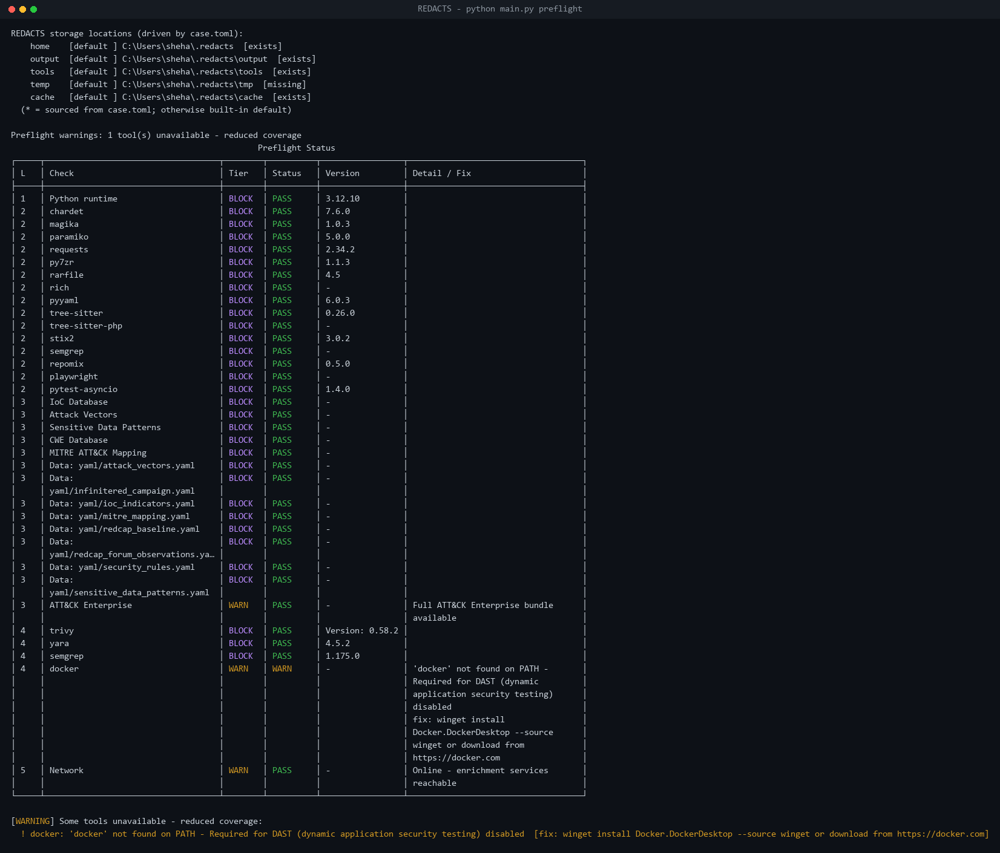
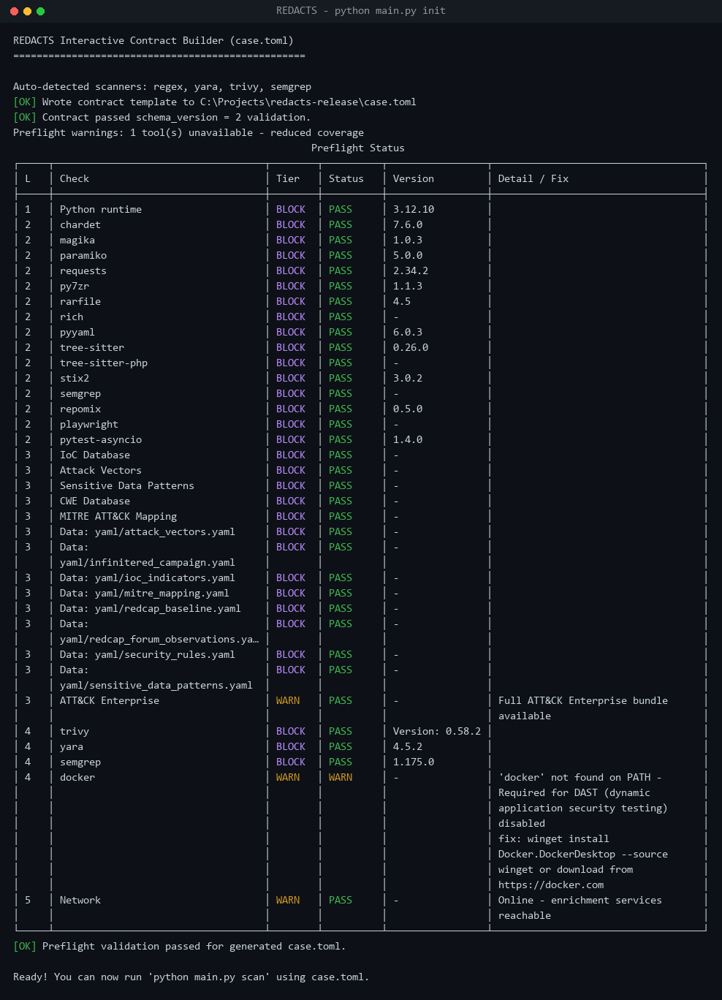
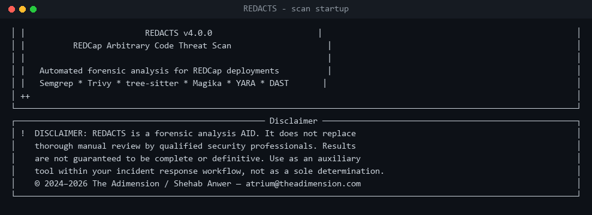
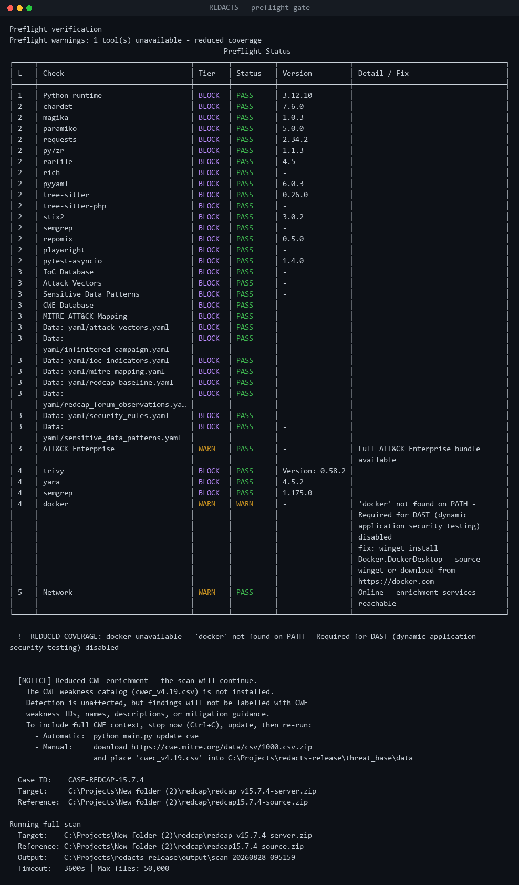
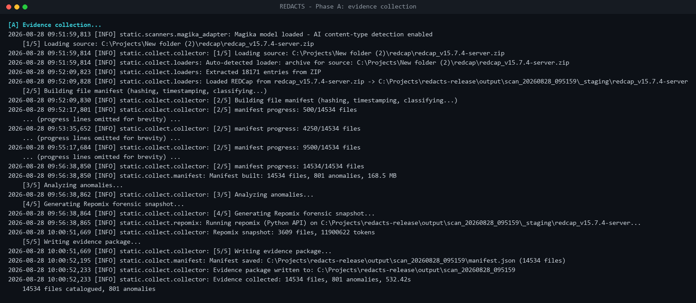
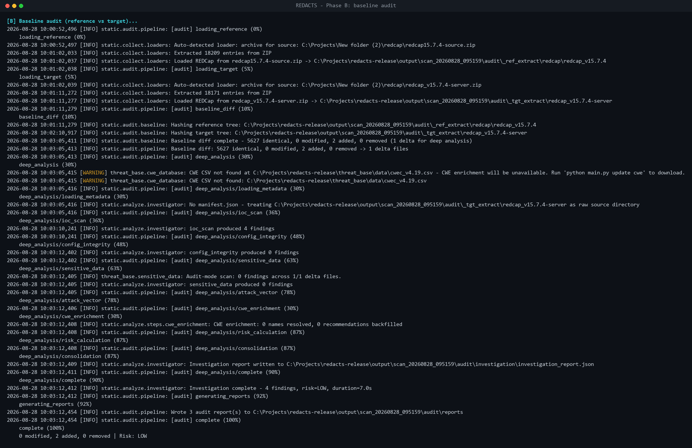
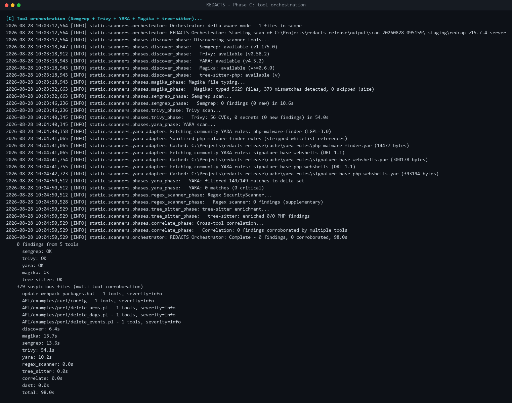
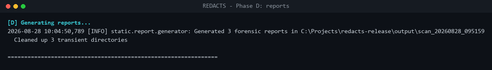
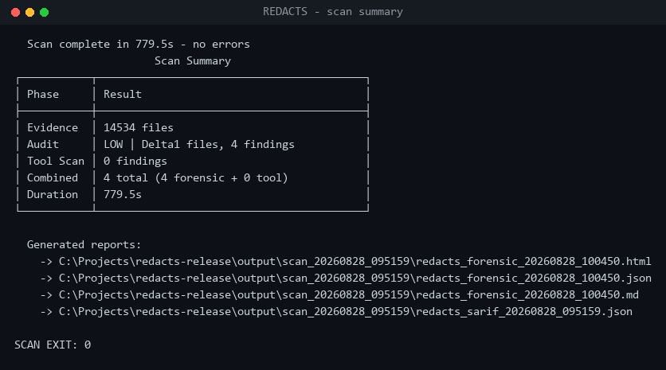

# REDACTS - User Guide

> REDACTS - REDCap Arbitrary Code Threat Scan. A forensic analysis aid for
> REDCap deployments. This guide documents the **CLI** as it exists in
> the source tree (verified against `main.py`, `static/cli/`,
> `static/core/paths.py`, `threat_base/updater.py`).

> **Disclaimer.** REDACTS is an aid, not a replacement for manual review by
> a qualified security professional. See [`DISCLAIMER`](DISCLAIMER).

---

## 1. Installation & first run

### 1.1 Requirements

- Python **3.13 (recommended) or 3.12**. **Not 3.14** - Semgrep's engine
  does not run on 3.14 (see the note below). A virtual environment is
  recommended but not bundled with the repository.
- Native scanner binaries **Trivy**, **YARA**, and **Semgrep** on
  `PATH`. Semgrep, Repomix, and Magika are Python packages installed
  with the project (`pip install -r requirements.txt`); Repomix no longer
  needs Node.js, and `node`/`npx` are not required on the host.
- Docker with the **Compose v2** plugin **only if dynamic (DAST) mode is
  enabled** (`[dynamic].enabled = true`). Verify with `docker compose
  version`. For a static-only scan, a missing Docker is a **WARN**, not a
  blocker.

Notes on Windows installs:

- `pip install --user <tool>` places console scripts in
  `%APPDATA%\Python\Python<ver>\Scripts\`, which is not on `PATH` by
  default. The Semgrep adapter probes that directory directly via
  `sysconfig`; for other tools either add the directory to `PATH`,
  install system-wide, or drop the binary into
  `contract.paths.tools_root` (auto-prepended to `PATH`).
- **Semgrep and Python 3.14.** Semgrep installs on 3.14 (its wheel allows
  it) but its bundled engine does not run there - it exits without emitting
  output. REDACTS detects this: `preflight` fails Semgrep as **non-functional**
  (not merely "found"), and the scan reports it as a gap rather than a clean
  "0 findings". Run on Python **3.13 or 3.12** for real Semgrep coverage.

### 1.2 Quick start

```powershell
python -m venv .venv                    # use Python 3.13 or 3.12
.\.venv\Scripts\Activate.ps1
pip install -r requirements.txt -r requirements-dev.txt

# Create the case file interactively (recommended). Point --target at the
# installation under review and --reference at a known-good REDCap release
# of the same version; init hashes them and detects available scanners.
python main.py init --target .\target.zip --reference .\reference.zip
#   (Or hand-edit the template: Copy-Item case.example.toml case.toml)

python main.py preflight                # verify the environment
python main.py update cwe               # fetch the CWE catalog for full enrichment
python main.py scan                     # mode comes from case.toml
```

For live progress on Windows PowerShell 5.1 (which buffers redirected
output), set `$env:PYTHONUNBUFFERED = '1'` before invoking `main.py`.

> **New to REDACTS?** Sec.4.8 walks through one complete real run —
> environment prep, preflight, `init`, all four scan phases, and how to read the
> result — with a screenshot of every step.

---

## 2. `case.toml` - single source of truth

REDACTS is **contract-driven**. A single `case.toml` file at the
repo root (or any path passed via `--case`) declares every value the
scan needs: case identity, target / reference inputs, storage paths,
scanner enablement, DAST topology, threat-base sources, and pinned
tool versions.

At startup, `main.py::_install_contract` loads the file, validates and
freezes it into a `FrozenCaseContract`, optionally verifies
`case.toml.lock` (SHA-256 over the canonical contract serialisation),
and installs the contract on a process-wide runtime context
(`static.core.runtime_context`). Every downstream module reads from
that contract - **no production code touches `os.environ` for
configuration**. An AST linter
([scripts/check_no_env_reads.py](scripts/check_no_env_reads.py))
enforces this invariant in CI; allowed exceptions are limited to
`static/core/contract.py`, `static/core/subprocess_env.py`,
`static/core/paths.py`, and `dynamic/helpers/_runtime_env.py`.

### 2.1 Required sections

| Section | Frozen as | Notes |
|---|---|---|
| `[case]` | `CaseIdentity` | id / analyst / organization / date / description |
| `[paths]` | `PathsConfig` | workspace_root, output_root, temp_root, cache_root, tools_root, logs_root, audit_trail |
| `[inputs.target]` | `InputArtifact` | path + sha256 (sha256 mandatory for local files) |
| `[inputs.reference]` | `InputArtifact` | same shape as target |
| `[inputs.upgrade_package]` | `InputArtifact \| None` | optional |
| `[static]` | `StaticConfig` | enabled, scanners[], formats[], severity_gate, limits |
| `[dynamic]` | `DynamicConfig` | enabled, runtime, suites, port, suite_timeout, keep_stack |
| `[dynamic.images.*]` | `DynamicImages` | mariadb / php / playwright / sandbox (digest-pinned) |
| `[dynamic.credentials]` | `DynamicCredentials` | admin + db + salt (loopback-only stack) |
| `[dynamic.network]` | `DynamicNetwork` | base_url, internal_hosts, xdebug_mode |
| `[dynamic.playwright]` | `PlaywrightConfig` | chromium executable + args + node version |
| `[threat_base]` | `ThreatBaseConfig` | offline_mode, allow_stale, ttl_hours |
| `[threat_base.sources.*]` | `ThreatBaseSources` | cwe / nvd / attack_stix / yara_rules (URL + sha256) |
| `[tools.*]` | `ToolsConfig` | trivy/yara native ToolSpecs + python ToolSpecs (semgrep, repomix, magika) |
| `[nix]` | `NixRuntimeConfig` | flake_ref, nixpkgs_rev, attribute names |
| `[security]` | `SecurityConfig` | network_disabled, ssrf_allowlist, sandbox flags |
| `[logging]` | `LoggingConfig` | level, format, retention_days, to_file, to_stderr |

[case.example.toml](case.example.toml) is the canonical, fully
populated template. Copy it to `case.toml` and edit in place.

### 2.2 The lockfile

`case.toml.lock` is a sealed snapshot - written by
`static.core.contract.write_lockfile(...)` - containing the SHA-256 of
the canonical contract bytes plus its `loaded_at_utc` timestamp. When a
lockfile is present next to `case.toml`, `_install_contract` runs
`verify_lockfile(...)` and aborts (`exit 2`) if the contract drifts
from the seal. This is how an analyst proves to a reviewer that the
run used exactly the configuration that was reviewed.

### 2.3 Resolved paths

`python main.py paths` prints the storage roots derived from the
contract's `[paths]` section, plus an `[exists]/[missing]` marker.

The `tools_root` directory is auto-prepended to `PATH` at the start of
every preflight / scan run via `paths.inject_tools_on_path()` so
binaries dropped there (manually or by the auto-installer) are visible
to `shutil.which`.

---

## 3. CLI reference

The entry point is `python main.py ...` (also `python -m main`). The
parser is defined in `main.py::build_parser`.

### 3.1 Global options

| Flag | Effect |
|---|---|
| `--case <path>` | Path to `case.toml` (default: `./case.toml`). Required for `scan`; optional for `paths` and `preflight`, which fall back to a built-in default contract when no case file is present. |

> Environment variables are **not** honoured for configuration. The
> only file that can change a scan's behaviour is `case.toml`. This is
> verified by [scripts/check_no_env_reads.py](scripts/check_no_env_reads.py),
> which fails CI on any new `os.environ` / `os.getenv` access in the
> production code paths.

### 3.2 Subcommands

#### `scan` - run analysis (default)

```text
python main.py scan [--mode {static,dynamic,full}]
```

| Mode | Behaviour |
|---|---|
| `static` | Runs the static pipeline only: evidence -> audit -> scan -> report. |
| `dynamic` | Runs the DAST orchestrator only. Boots the runtime stack and executes Playwright suites. |
| `full` | Runs the static pipeline, which itself invokes DAST via the shared `DASTOrchestrator`. |

When `--mode` is omitted the default is derived from the contract:
`full` if `[dynamic].enabled = true`, otherwise `static`. Running
`python main.py` with no subcommand is equivalent to `scan` with that
derived mode.

The scan path is non-interactive. If `case.toml` is missing or invalid
the scan aborts with an explicit error rather than prompting.

**Scan exit codes** (`static/cli/workflow.py`):

| Code | Meaning |
|---|---|
| `0` | Clean run; no phase errors and no findings at or above `[static].severity_gate`. |
| `1` | At least one phase reported a hard error (e.g. evidence collection failed). |
| `2` | Severity gate triggered (one or more findings at or above the configured gate level), or contract validation / lockfile verification failed at startup. |

Exit `2` is therefore the normal outcome for a successful scan that
found real issues; it is distinct from `1` so CI can tell "the scan
worked and found something" apart from "the scan itself broke".

#### `preflight` - verify environment

```text
python main.py preflight [--install]
```

Runs the 5-layer preflight defined in `static/cli/preflight.py`.
With `--install`, BLOCK-tier failures trigger an auto-install attempt
(pip for Python tools; Trivy/YARA via the bundled installer) followed
by a re-check. The auto-installer honours `[security].network_disabled`
and will refuse to reach the network when the contract forbids it.

Exit codes:

- `0` - all required (BLOCK-tier) checks passed. WARN-tier failures
  print a warning line but do not change the exit code.
- `1` - at least one BLOCK check failed.

#### `update` - refresh threat database

```text
python main.py update [{cwe|attack|yara|nvd|all}] [--no-confirm]
```

The positional argument selects a single source; omitting it (or
passing `all`) refreshes every source. `--no-confirm` skips the
interactive y/n prompt and is intended for CI use.

Downloads are routed through `assert_network_allowed`, so an `update`
call will fail fast when `[security].network_disabled = true` or when
the source URL is not in `[security].ssrf_allowlist`. Cached entries
remain usable per `[threat_base].ttl_hours` and `allow_stale`.

#### `paths` - show resolved storage locations

```text
python main.py paths
```

Prints the storage roots from Sec.2.3 and exits `0`.

#### `secrets` - manage the OS credential store

```text
python main.py secrets {set|get|delete|list} [<key>] [<value>]
```

Forwarded to `static.core.secrets.cli_main`. The credential store
(via the `keyring` package) holds runtime secrets - e.g. NVD API keys
or remote-fetch credentials - that must not appear in `case.toml` or
the lockfile. Only `secrets set` prompts (via `getpass`); the scan
flow itself remains non-interactive.

### 3.3 Configuration sources

There are no environment-variable knobs for configuration. Every
run-time behaviour is declared in `case.toml` (Sec.2.1). This is
intentional: in a forensic context, configuration that lives in a
process's environment is invisible to a peer reviewer. The contract
plus lockfile pair makes the run reproducible from disk alone.

---

## 4. Typical workflows

The scan workflow is internally divided into four phases. The labels
appear in log lines and per-tool status blocks:

- **Phase A - collect**: ingest the target/reference trees and build a
  SHA-256 manifest (`static/collect/`).
- **Phase B - audit**: diff target against reference; produce the
  added/modified/deleted file set (`static/audit/`).
- **Phase C - analyse**: run scanners (regex, tree-sitter, Semgrep,
  Trivy, YARA) over the diff (`static/scanners/`, `static/analyze/`).
- **DAST** (optional): drive Playwright suites against a disposable
  Dockerised REDCap (`dynamic/`).

### 4.1 First-time setup verification

```powershell
python main.py paths
python main.py preflight
```

`paths` prints the resolved storage locations. `preflight` runs the
5-layer environment check and exits `0` if every BLOCK-tier check
passes. Add `--install` to let preflight repair missing tools
in-place.

### 4.2 Refresh threat data

```powershell
python main.py update                # all sources
python main.py update cwe            # single source
python main.py update --no-confirm   # for CI
```

On first run the CWE CSV is absent. See Sec.4.6 for exactly what the
scan does about it.

### 4.3 Static scan

```powershell
python main.py scan --mode static
```

Reports land under `contract.paths.output_root` (default
`output/scan_<timestamp>/`). A single scan writes **three kinds of report** -
read them in this order:

| Report | Files | What it is / when to read it |
|---|---|---|
| **Forensic** | `redacts_forensic_*.{html,md,json}` | **Start here.** The primary human-facing deliverable: consolidated findings with chain-of-custody and evidence provenance. This is what you hand to an incident-response reviewer. |
| **Audit** | `audit/reports/redacts_audit_*.{html,md,json}` | The baseline diff plus deep analysis of *what changed* versus the known-good reference release. Read it to see exactly which files were added/modified and what those changes contain. |
| **SARIF** | `redacts_sarif_*.json` | Machine-readable raw scanner output (SARIF 2.1.0) for CI dashboards and IDE plugins - not meant to be read by a human directly. |

Each report also states its own purpose and names its companions in its header,
so they can't be confused once opened. The HTML versions are self-contained
(open in any browser; no internet needed).

### 4.4 Dynamic (DAST) scan

```powershell
python main.py scan --mode dynamic
```

Boots the disposable REDCap stack via `docker compose` and runs the
Playwright suites declared in `[dynamic].suites`. Requires Docker
with the Compose v2 plugin.

### 4.5 How runtime failures are reported

The per-tool status block printed at the end of phase C reflects
actual phase outcome:

- `tool: OK` - phase ran to completion.
- `tool: FAILED` - phase raised or the scanner reported an error;
  the failure is also added to the run's `runtime_gaps` list and
  surfaces in the summary line as `Scan finished in Xs with N
  warning(s)`.
- `tool: SKIPPED` - the phase was disabled by the contract or by an
  earlier dependency check.

A scan that completes with a failed tool still produces reports for
the tools that ran; the reports record which scanners contributed and
which did not.

### 4.6 Reduced CWE enrichment (missing CWE data)

The CWE ("Common Weakness Enumeration") catalog is MITRE's public list
of software-weakness types. REDACTS uses it to *label* findings with a
CWE ID, name, description, and mitigation guidance. It is enrichment,
not detection: with the catalog absent, the scanners still find the
same issues - each finding just carries less classification context.

If the CWE CSV (`threat_base/data/cwec_v4.19.csv`) is missing when a
scan starts, REDACTS prints a one-time **Reduced CWE enrichment**
notice up front and then continues. It does **not** prompt, and it does
**not** download anything on its own - the scan path is non-interactive
by design so it runs unattended in CI and pipelines.

The notice states that the scan is continuing and how to obtain the
full data. If you would rather have full enrichment, stop the scan
(`Ctrl+C`) and install the catalog first, by either method:

- **Automatic** (needs network; unavailable when
  `[security].network_disabled = true`):

  ```powershell
  python main.py update cwe
  ```

- **Manual / offline**: on any machine with internet access, download
  the CWE CSV from <https://cwe.mitre.org/data/csv/1000.csv.zip> and
  place the extracted `cwec_v4.19.csv` into `threat_base/data/`.

Then re-run the scan. The notice disappears once the file is present.

### 4.7 INFINITERED: what REDACTS proves, and what it does not

REDACTS carries two separate bodies of evidence for REDCap compromise. Reports
label which one a finding came from, because they do not mean the same thing.

| Stream | What it is | What a hit means |
|---|---|---|
| **GTIG INFINITERED (exact)** | The seven SHA-256 digests, the `G_Backdoor_INFINITERED_1` YARA rule, and the literal implant strings published by the Google Threat Intelligence Group for UNC6508 (Sept 2023 – Nov 2025) | **Family attribution.** Reported as *conclusive*. Treat the host as compromised and start incident response. |
| **REDCap Community Forum** | REDCap-specific persistence and hygiene patterns reported by the Consortium community (Dec 2025 – Feb 2026) — SQLite `redcap.db`, `eval(gzinflate(...))` chains, `.user.ini auto_prepend_file`, PHP in `/edocs/` | **A strong lead, not proof.** Reported as *suspicious* at unchanged severity. Investigate; corroborate with a hash or YARA hit before calling it INFINITERED. |

GTIG **did not confirm how UNC6508 gained initial access**. REDACTS therefore
ships no exploit rule and no CVE claim for this campaign, and a clean scan is not
evidence that entry did not occur.

Two specific cautions:

- **`help.php` on its own is not evidence.** GTIG documented a web shell with
  that name, but REDCap ships legitimate help pages. Corroborate with a digest or
  YARA match.
- **A bare `REDCAP-TOKEN` string is not evidence.** REDCap and its modules use
  token language legitimately. The backdoor pairs that cookie with a magic flag —
  that paired form is what REDACTS treats as conclusive.

#### Hunt list — not detectable from a PHP tree

These are published INFINITERED indicators that no filesystem scanner can see.
Check them in the relevant system, not in REDACTS:

| Indicator | Where to look | What a hit proves |
|---|---|---|
| Workspace compliance rule named **`Patroit`** (sic) | Google Workspace admin console → compliance/routing rules | Silent mail forwarding was configured. Strong. |
| BCC recipient **`BebitaBarefoot774@gmail.com`** | Mail gateway / Workspace audit logs | Exfiltration destination. Strong. |
| Admin login from **`23.169.65.49`** | REDCap and OS auth logs | Login from a host GTIG tied to the actor. Corroborate — IPs are reassigned. |
| Session rows keyed `xc32038474a…` | `SELECT session_id FROM redcap_sessions WHERE session_id LIKE 'xc32038474a%'` | Harvested credentials stored in your database. Rotate every REDCap credential. |

The backdoor's command tags (`00`, `02`, `03`, `04`, `05`) are recorded in the
bundled YARA file as analyst context only. They are too short to search for
safely and REDACTS does not scan for them.

Google also published five **YARA-L** rules for this campaign. Those run in
Google SecOps against logs, not against files, so REDACTS does not ship them —
use them in SecOps if you have it.

Source for everything above: Google Threat Intelligence Group,
<https://cloud.google.com/blog/topics/threat-intelligence/prc-targets-us-medical-research>
(retrieved 2026-07-28). If you find evidence of compromise, contact your security
team and the REDCap Consortium.

### 4.8 Worked example: a complete run, start to finish

Every screen below is from one real scan of REDCap 15.7.4 — a deployed server
tree checked against the official source release. Nothing is mocked up.

| | |
|---|---|
| **Target** (under review) | `redcap_v15.7.4-server.zip` — 14,534 files |
| **Reference** (known-good) | `redcap15.7.4-source.zip` |
| **Python** | 3.12.10 |
| **Mode** | static (`[dynamic].enabled = false`) |
| **Wall clock** | 779.5 s (~13 min) |

> **About the images.** The `.txt` captures in `docs/captures/` are byte-for-byte
> what REDACTS wrote. Rich suppresses ANSI colour when output is redirected to a
> file, so the `.png` versions re-apply the CLI's own colour scheme
> (`PASS` green, `WARN` yellow, `FAIL` red, `BLOCK` magenta) to match what you
> see on a live terminal. Only colour is added — no text is altered.

#### Step 0 — Prepare the environment

Install the Python dependencies (see [SETUP.md](SETUP.md) for the native
binaries: Trivy, YARA, Semgrep):

```bash
python -m venv .venv          # use Python 3.13 or 3.12 — not 3.14
.venv\Scripts\activate
pip install -r requirements.txt -r requirements-dev.txt
```

#### Step 1 — Verify the environment

```bash
python main.py preflight
```



Read the **Tier** column, not just the colours. `BLOCK` items must pass;
`WARN` items are optional. Above, `docker` is `WARN` because this is a
static-only scan — that is expected, not a failure. Exit code `0` means ready.

#### Step 2 — Create the case file

`init` hashes both archives, auto-detects the available scanners, writes a valid
`case.toml`, and re-runs preflight against it:

```bash
python main.py init \
  --target   redcap/redcap_v15.7.4-server.zip \
  --reference redcap/redcap15.7.4-source.zip \
  --case-id "CASE-REDCAP-15.7.4" --analyst "Security Analyst"
```



```text
Auto-detected scanners: regex, yara, trivy, semgrep
[OK] Wrote contract template to case.toml
[OK] Contract passed schema_version = 2 validation.
[OK] Preflight validation passed for generated case.toml.
```

#### Step 3 — Run the scan

```bash
python main.py scan
```

The banner states the disclaimer every run — REDACTS is an analysis aid, not a
verdict:



Preflight runs again inside the scan, so a scan can never proceed on an
environment that would silently produce partial coverage:



**Phase A — evidence collection.** Both archives are extracted, hashed
(SHA-256), and content-typed with Magika. This is the slowest phase: two trees
of ~14.5k files each.



**Phase B — baseline diff and deep investigation.** The diff is the scoping
layer: only files that differ from the reference go to deep analysis.



```text
0 modified, 2 added, 0 removed | Risk: LOW
Investigation complete - 4 findings, risk=LOW
```

**Phase C — tool orchestration.** All five scanners run against the delta set.
The per-tool `OK` / `FAILED` / `SKIPPED` line is the honest coverage record —
check it before trusting a clean result.



```text
semgrep: OK      trivy: OK      yara: OK
magika:  OK      tree_sitter: OK
Orchestrator: Complete - 0 findings, 0 corroborated, 98.0s
```

**Phase D — reports.**



#### Step 4 — Read the result



```text
Evidence    14534 files
Audit       LOW | Delta 1 file, 4 findings
Tool Scan   0 findings
Duration    779.5s
SCAN EXIT: 0
```

> The screenshot above reads `Delta1 files`; the text block reads `Delta 1 file`.
> That capture was taken just before a spacing/pluralisation fix to the summary
> table. The captures are kept byte-exact rather than edited after the fact, so
> the image is left as recorded — the text block shows current output.

Exit `0` = no finding reached the `[static].severity_gate`. See Sec.4.3 for the
three report types and which to read first.

**Interpreting this particular run.** Two files existed in the deployment but
not the official release — `ControlCenter/error_log` and
`ControlCenter/repomix-output.xml`. Both are reported as *added* (the anomaly is
never hidden), but neither is malicious: a PHP error log and a leftover Repomix
bundle. The overall verdict is **LOW** and no INFINITERED attribution is
claimed, because no GTIG-published hash, YARA hit, or implant string was found.
That is the correct outcome for a clean-but-customised install — see Sec.4.7 for
what REDACTS will and will not call INFINITERED.

---

## 5. Troubleshooting

| Symptom | Likely cause / fix |
|---|---|
| `paths` shows `[missing]` for `temp` / `cache` | First run; the directory is created lazily on first use. Run `preflight` to materialize it. |
| Preflight reports `'<tool>' not found on PATH` | Drop the binary into `contract.paths.tools_root` (auto-prepended to `PATH`) or install it system-wide. On Windows, `pip install --user` places scripts in `%APPDATA%\Python\Python<ver>\Scripts\`, which is not on `PATH` by default. |
| Preflight: `semgrep ... installed but not functional` / scan: `Semgrep exited cleanly but produced no SARIF output` | You are on Python 3.14, where Semgrep's engine does not run. This is not a false alarm - Semgrep produced **no** coverage. Recreate your environment on Python **3.13 or 3.12** and re-run. (Earlier versions silently reported "0 findings" here; REDACTS now surfaces it instead of masking it.) |
| `docker compose` rejects `-f` with `unknown shorthand flag` | Compose v1 (the deprecated `docker-compose` Python wrapper) is on `PATH` ahead of the Compose v2 plugin, or the v2 plugin is missing. Install / upgrade Docker so that `docker compose version` succeeds, then re-run. |
| `--mode full` followed by `--mode dynamic` | `full` already invokes DAST inside the static pipeline. Run one of the two, not both. |
| Captured `.log` lags minutes behind the actual run on Windows PowerShell 5.1 | Set `$env:PYTHONUNBUFFERED = '1'` before invoking `main.py` so writes are flushed line-by-line. |
| Scan exits `2` on a clean-looking run | Severity gate triggered. Check the `Severity gate '<level>' triggered: N finding(s) at or above gate.` line at the end of the output. Lower the gate in `[static].severity_gate` if the policy is wrong, or treat the findings. |
| `[FATAL] case.toml is invalid: sha256 mismatch` / `path does not exist` | Contract validation refused the run. The hash in `[inputs.target].sha256` no longer matches the file on disk, or the path was moved. Recompute and update `case.toml`. |
| `[NOTICE] Reduced CWE enrichment` at scan start | The CWE catalog is not installed. Findings are still detected but not labelled with CWE IDs. Install it with `python main.py update cwe` (or the manual method) and re-run. See Sec.4.6. |

---

## 6. File map (for contributors)

| Path | Role |
|---|---|
| [main.py](main.py) | Argparse entry point + `_install_contract`. |
| [static/core/contract.py](static/core/contract.py) | `FrozenCaseContract` schema, loader, lockfile sealing/verification. |
| [static/core/runtime_context.py](static/core/runtime_context.py) | Process-wide contract holder (`set_contract` / `get_optional_contract`). |
| [static/core/subprocess_env.py](static/core/subprocess_env.py) | Builds the env dict for child processes from the contract. |
| [scripts/check_no_env_reads.py](scripts/check_no_env_reads.py) | AST linter forbidding `os.environ` reads outside the allowlist. |
| [static/cli/preflight.py](static/cli/preflight.py) | 5-layer preflight. |
| [static/cli/workflow.py](static/cli/workflow.py) | Static pipeline phases, per-tool status reporting, severity-gate enforcement. |
| [static/scanners/orchestrator.py](static/scanners/orchestrator.py) | Phase scheduler; collects `phase_failures` and `phase_timings`. |
| [threat_base/updater.py](threat_base/updater.py) | Threat data refresh; routes through `assert_network_allowed`. |
| [dynamic/orchestrator.py](dynamic/orchestrator.py) | DAST orchestrator. |
| [static/core/paths.py](static/core/paths.py) | Single source of truth for storage locations. |
